<h1 align="center">
  Hi 👋, I'm Niladri Modak
</h1>

<h3 align="center">
  I solve real world problems with code
</h3>

  

---

## 👨‍💻 About Me

- 🌱 I’m currently learning **Full Stack Web Development**
- 💬 Ask me about **MERN anything javascripty**
- 🐴 Love to solve **DSA** and achieved **Knight @Leetcode**
- 📫 How to reach me: **niladrimodakk2001@gmail.com**

---

## 💼 Experience

### 🏢 TCS — System Engineer
**12 February 2026 – Present**

Currently working as a **System Engineer** at TCS.

---

### 🏢 Nexucon — Assistant System Engineer
**6 Months**

Worked as an **Assistant System Engineer** at Nexucon for 6 months.

---

## 🤝 Connect With Me

---

## 💻 Tech Stack

### Languages

  

  

  

  

  

  

  

### Frameworks & Libraries

  

  

  

  

### Databases & Cloud

  

  

  

  

  

  

### DevOps & Tools

  

  

  

  

  

---

## 📊 GitHub Statistics

  

  

  

---

  <i>Thanks for visiting my profile! 🚀</i>

